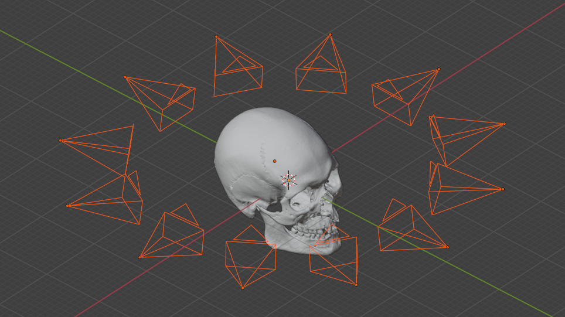
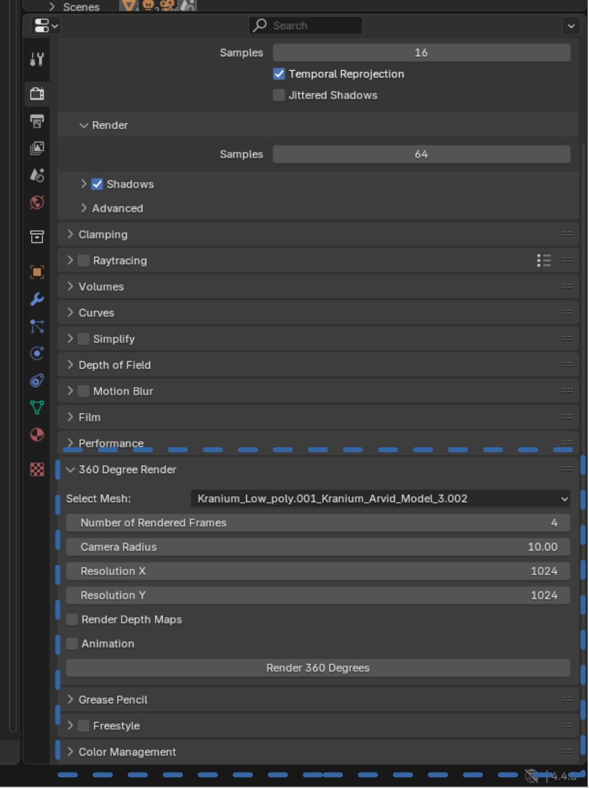

# MultiViewRender

This repository holds a blender addon for rendering the an object from multiple view.
You are welcome to use it, but keep in mind that it is a work in progress.

## Usage
1) Load the script in blender "Scripting" tab, and run it.
2) After Running the script you will notice a new section in the "Render Properties" section.

  
  Some text that appears to the right of the image.  
  You can continue writing here and it will wrap around the image.  
  Make sure to leave a blank line after the `` tag if needed.

